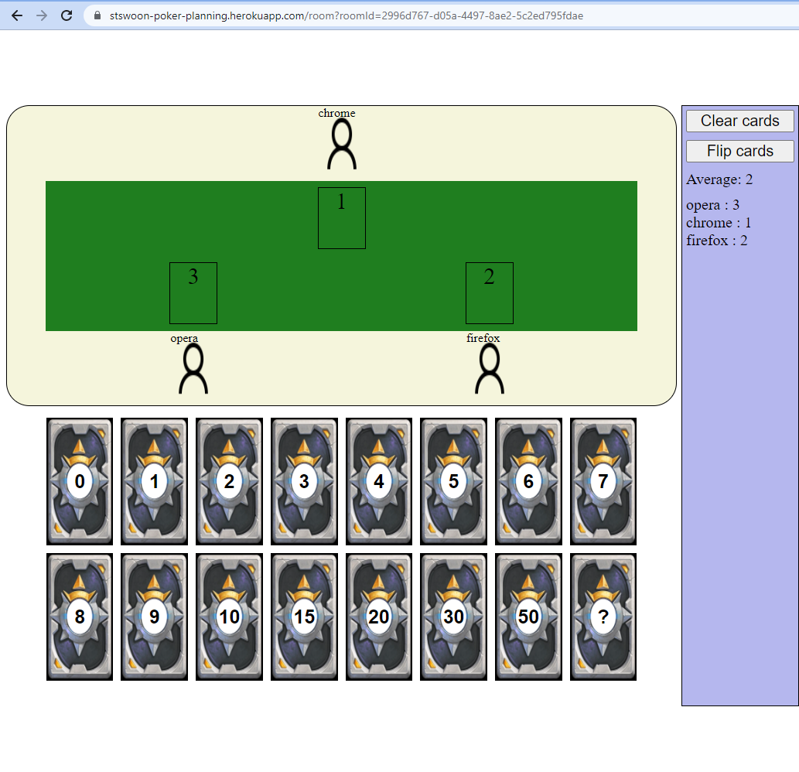

# Porker planning

## Tasks

Backend:

- [x] /api/health
- [x] static 
- [x] ws://api/roomState?roomId={roomId}&userId={userId}&userName={userName}
  - [x] on connect addUser {id, name} and create room if empty
  - [x] on disconnect removeUser {id}
  - [x] card {id, cardValue}
  - [x] clear {}
  - [x] flip {}
  - [x] broadcast
- not fail on error 
- [x] remove old rooms

Frontend

* [x] /?backToRoom={id}
  * [x] set name and show create room
  * [x] change name
  * [x] if `?backToRoom` then set name and redirect to `/room`
* [x] /room?roomId
  * [x] if userName empty in cookie then redirect to `/?redirectRoomId={id}`
  * [x] create room
  * [x] run ws connect
  * [x] send addUser command
  * [x] buttons: `clear`, `flip`
* Pretty view:
  * [x] greeting
  * info
  * cards
  * table 
* [x] Testing
* Docs
* Refactoring

